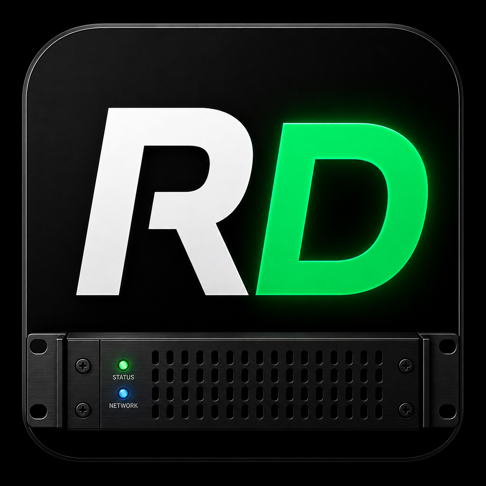
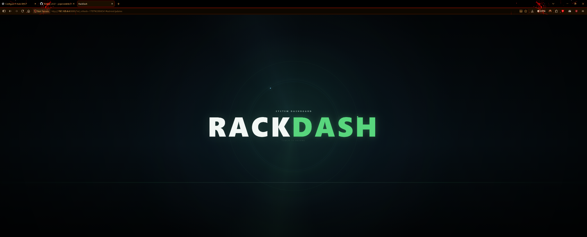
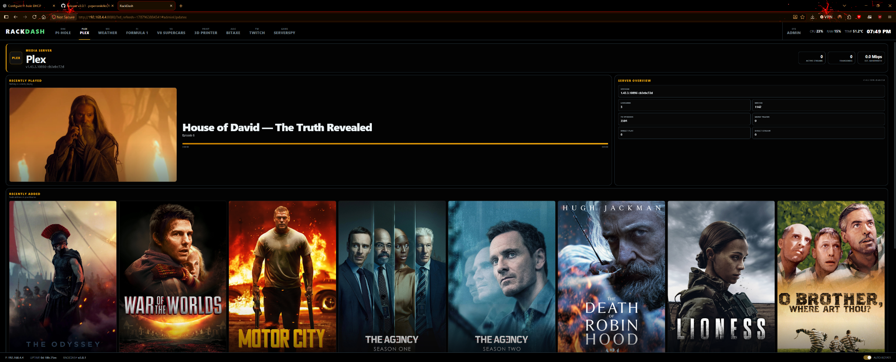
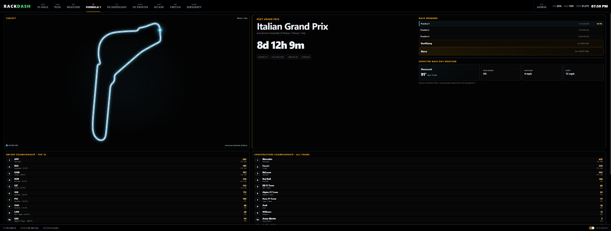
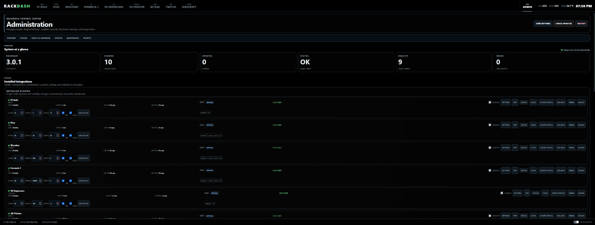

<p align="center">
  
</p>

<h1 align="center">RackDash 3</h1>

<p align="center">
  A lightweight, plugin-driven dashboard built for rackmount displays, touchscreens, Raspberry Pis, homelabs, and unusual screen sizes.
</p>

<p align="center">
  <strong>Responsive.</strong> <strong>Touch-friendly.</strong> <strong>Plugin-first.</strong> <strong>Self-hosted.</strong>
</p>

---

## Features

- **Plugin-driven dashboard** — each top-level Python plugin becomes its own dashboard tab.
- **Responsive layouts** — designed for ultra-wide rack displays, normal monitors, tablets, portrait screens, and odd resolutions.
- **Touchscreen controls** — swipe between tabs, scroll plugin pages, and use larger touch targets when needed.
- **Auto rotation** — rotate through enabled dashboards automatically with per-plugin timing controls.
- **Fullscreen RackDash mode** — tap/click the RackDash logo for an animated fullscreen RackDash display; tap it again to return.
- **Admin dashboard** — configure plugins, display behavior, updates, hardware, backups, security, and diagnostics from the browser.
- **Plugin isolation** — a broken plugin is quarantined instead of taking down RackDash.
- **Live plugin health** — latency, last poll, last success, failure count, sanitized errors, and test controls.
- **Automatic update checks** — optionally check RackDash and supported plugins for updates every 24 hours.
- **Remote kiosk recovery** — clients that lose RackDash during an update automatically perform a fresh reload after reconnecting.
- **I2C OLED support** — system information, plugin-provided pages, and static artwork on supported OLED displays.
- **Themes and display tuning** — Dark, OLED Black, Blue Steel, UI scaling, overscan/safe area, burn-in protection, and idle dimming.
- **Server-side secrets** — passwords, tokens, and API keys stay in `config.env` and are masked in Admin.
- **No frontend framework required** — RackDash uses Python, Flask, HTML, CSS, and plain JavaScript.

## Included Plugins

| Plugin | Highlights |
| --- | --- |
| **Pi-hole** | DNS activity, blocked queries, clients, domains, query types, upstreams, trends |
| **Plex** | Now Playing, Recently Played, Recently Added, On Deck, server statistics |
| **Weather** | Current conditions, animated weather scene, hourly/7-day forecast, animated NOAA radar |
| **Formula 1** | Next race, sessions, weather, top 10 drivers, constructors, results, headlines |
| **V8 Supercars** | Next event, weather, top 10 drivers/teams, recent results, headlines |
| **3D Printer** | Klipper/Moonraker status, temperatures, print progress, G-code preview, optional camera stream |
| **Bitaxe** | Hashrate, power, efficiency, thermal data, pool/share statistics, system health |
| **Twitch** | Multi-channel live status, category, viewers, title, uptime, recent broadcast information |
| **ServerSpy** | Game-server status, players, maps, latency, server metadata |
| **Uptime Kuma** | Monitor status, response time, groups, rolling uptime, problem-only filtering |

---

## Preview

RackDash is designed for wide rackmount screens first, while still adapting cleanly to standard monitors, tablets, portrait displays, and unusual resolutions.

### Fullscreen RackDash Mode

Tap or click the **RACKDASH** wordmark in the upper-left corner to turn the display into an animated fullscreen RackDash screen. Tap the fullscreen logo to resume the dashboard.

<p align="center">
  
</p>

### Media Dashboard

Plex shows current or recently played media, recently added titles, server information, active streams, and playback details in a layout designed to make good use of wide displays.

<p align="center">
  
</p>

### Motorsport Dashboard

The Formula 1 plugin combines the next event, animated circuit view, race-weekend schedule, weather, driver standings, and constructor standings on one screen.

<p align="center">
  
</p>

### Administration

RackDash includes a browser-based control center for plugin configuration, display behavior, health, updates, backups, security, diagnostics, and development tools.

<p align="center">
  
</p>

---

## Installation

### 1. Install the required system packages

On Debian / Raspberry Pi OS:

```bash
sudo apt update
sudo apt install -y git python3-venv python3-pip
```

### 2. Download RackDash

```bash
git clone https://github.com/peperonikiller/RackDash.git
cd RackDash
```

### 3. Install RackDash

```bash
./install.sh
```

The installer creates the Python virtual environment, installs dependencies, and creates `config.env` when needed.

### 4. Configure RackDash

```bash
nano config.env
```

You can also configure most settings later from **Admin** in the browser.

### 5. Start RackDash

```bash
./venv/bin/python app.py
```

Open:

```text
http://127.0.0.1:8080
```

If you want to access RackDash from another device on your LAN, set:

```env
RACKDASH_HOST=0.0.0.0
```

Then open RackDash using the host machine's IP address.

### Run RackDash as a service

```bash
./scripts/install-systemd.sh
```

RackDash can then restart automatically after updates or failures.

### Chromium kiosk mode

A dedicated RackDash display can use:

```bash
chromium \
  --user-data-dir="$HOME/.config/rackdash-chromium" \
  --kiosk \
  --noerrdialogs \
  --disable-session-crashed-bubble \
  --disable-translate \
  --overscroll-history-navigation=0 \
  --disable-pinch \
  http://127.0.0.1:8080
```

---

## Using RackDash

The dashboard tabs across the top represent enabled plugins. On touch displays, swipe horizontally to move between tabs and vertically to scroll the current page.

The **AUTO ROTATE** switch controls automatic tab rotation. RackDash remembers this choice in the browser profile.

The **Admin** tab is always manual-only and never enters automatic rotation. Admin provides access to:

- plugin settings, enable/disable controls, display order, refresh rate, tab visibility, and rotation timing
- RackDash and plugin update checks
- official plugin updates, rollback, install, and uninstall controls
- core display settings and themes
- I2C/OLED configuration
- backup and restore
- logs and diagnostics
- Admin authentication and security settings
- quarantined plugin information
- Developer Mode and plugin debugging tools

Tap or click the **RACKDASH** logo in the upper-left corner to enter the fullscreen animated RackDash display. Tap the fullscreen logo to resume.

---

## I2C / OLED Displays

RackDash can drive small auxiliary OLED displays alongside the main dashboard.

Supported presets include:

- SH1106 / SSH1106
- SH1107
- SSD1306 128×64
- SSD1306 128×32
- SSD1309
- SSD1325
- SSD1327

Display modes include **System Only**, **System + Plugins**, and **Static Icon**.

On a Raspberry Pi, a common SH1106/SSD1306 I2C connection is:

| OLED | Raspberry Pi |
| --- | --- |
| VCC | 3.3 V |
| GND | GND |
| SDA | GPIO2 / SDA1 |
| SCL | GPIO3 / SCL1 |

Enable I2C with:

```bash
sudo raspi-config
sudo apt install -y i2c-tools
sudo usermod -aG i2c "$USER"
sudo reboot
```

Then verify the display:

```bash
i2cdetect -y 1
```

---

## Updates, Backups, and Recovery

RackDash supports manual update checks and an optional **Automatically check for updates** setting. When enabled, RackDash checks the core and supported plugins every 24 hours. Automatic checks only notify you; they do not install anything.

Official plugins can be updated independently from the RackDash application. RackDash validates the plugin before replacing it and keeps rollback copies.

Core updates create a backup before replacing RackDash files. Persistent configuration, data, the Python environment, and third-party plugins are preserved by the updater.

If a kiosk browser loses connection while RackDash is restarting, it displays a connection-lost screen. When RackDash becomes reachable again, the client performs a cache-busted full reload so updated plugin HTML, CSS, and JavaScript are loaded immediately.

---

## Security

RackDash listens on `127.0.0.1` by default. Only use `RACKDASH_HOST=0.0.0.0` when LAN access is intentional.

Admin write actions can be protected by a password/PIN. RackDash stores a server-side password hash and does not save the Admin password in `config.env`.

Configuration fields declared as `password`, `secret`, or `token` are masked in the browser. Keep `config.env` private and never commit it to source control.

---

# Plugin Development

RackDash plugins are intentionally simple: one Python file can contain the backend integration, HTML, CSS, JavaScript, settings schema, custom routes, and OLED output.

A plugin is discovered automatically when a top-level `.py` file is placed inside `plugins/`. Files beginning with `_` are treated as helper modules and are not loaded as plugins.

For a ready-to-edit starting point, use:

```text
plugins/examples/rackdash_plugin_template.py
```

The full reference also lives in [`PLUGIN_GUIDE.md`](PLUGIN_GUIDE.md).

## Minimal Plugin

```python
PLUGIN_ID = "hello"
PLUGIN_NAME = "Hello"

PLUGIN_HTML = """
<div class="surface">
  <h1 data-role="message">Loading...</h1>
</div>
"""

def get_data():
    return {
        "message": "Hello from RackDash"
    }

PLUGIN_JS = """
window.RackDashPlugins.hello = {
  render(data, root) {
    root.querySelector('[data-role="message"]').textContent = data.message;
  }
};
"""
```

Restart or reload RackDash and the plugin becomes a dashboard tab.

## Plugin Contract

### Required

| Item | Description |
| --- | --- |
| `PLUGIN_ID` | Unique plugin ID matching `^[a-z0-9][a-z0-9_-]*$` |
| `PLUGIN_NAME` | Human-readable plugin/tab name |
| `PLUGIN_HTML` | HTML fragment inserted into the plugin page |
| `get_data()` | Server-side function that **must return a Python `dict`** |

### Optional Metadata

| Setting | Default | Purpose |
| --- | --- | --- |
| `PLUGIN_VERSION` | `0.0.0` | Plugin version |
| `PLUGIN_ORDER` | `100` | Default tab order |
| `PLUGIN_REFRESH_SECONDS` | `10` | Default backend refresh interval; minimum 1 second |
| `PLUGIN_ACCENT` | `#dce8ee` | Plugin accent color |
| `PLUGIN_ICON` | empty | Small tab subtitle/icon text |
| `PLUGIN_PUBLIC_ERROR` | `<name> unavailable` | Safe browser-facing error |
| `PLUGIN_CSS` | empty | Plugin-specific CSS |
| `PLUGIN_JS` | empty | Browser renderer/callbacks |
| `PLUGIN_GITHUB` | empty | GitHub repository used for update checking |
| `PLUGIN_MIN_RACKDASH` | empty | Minimum compatible RackDash version |
| `PLUGIN_MAX_RACKDASH` | empty | Maximum compatible RackDash version |
| `PLUGIN_CAPABILITIES` | `[]` | Declared capabilities |
| `PLUGIN_OFFICIAL` | `False` | Marks first-party RackDash plugins |
| `PLUGIN_SOURCE_PATH` | empty | Source path for official plugin updates |
| `PLUGIN_CONFIG` | `[]` | Declarative settings shown in Admin |

Treat `PLUGIN_ORDER` and `PLUGIN_REFRESH_SECONDS` as defaults. Users can override presentation and refresh settings from Admin without editing your source file.

## Server-Side Data

RackDash calls:

```python
def get_data():
    return {
        "temperature": 72,
        "status": "online"
    }
```

Runtime timing and health tracking are handled automatically. RackDash records:

- last poll attempt
- last successful poll
- response time
- consecutive failures
- sanitized last error

Raise exceptions normally when a request fails. RackDash logs the traceback server-side and exposes only `PLUGIN_PUBLIC_ERROR` to the dashboard.

Keep secrets on the Python side. Do not return passwords, tokens, API keys, or credentials from `get_data()`.

## Declarative Plugin Settings

Plugins can define settings without building a settings UI:

```python
PLUGIN_CONFIG = [
    {
        "key": "MY_SERVICE_URL",
        "label": "Service URL",
        "type": "text",
        "default": "http://127.0.0.1:9000",
        "required": True,
        "help": "Address of the service."
    },
    {
        "key": "MY_SERVICE_TOKEN",
        "label": "API Token",
        "type": "secret",
        "default": ""
    }
]
```

RackDash adds missing defaults to `config.env`, generates the Admin settings dialog, validates submitted values, and masks sensitive values.

Supported field types:

| Type | Behavior |
| --- | --- |
| `text` | Standard text input |
| `number` | Numeric value |
| `checkbox` | Boolean-style toggle |
| `select` | Selection using `options` |
| `password` | Masked sensitive input |
| `secret` | Masked sensitive input |
| `token` | Masked sensitive input |

Available field properties include:

| Property | Purpose |
| --- | --- |
| `key` | Environment/config key |
| `label` | Display label |
| `type` | Input type |
| `default` | Default value |
| `required` | Marks the field required for plugin health |
| `help` | Help text displayed in Admin |
| `options` | Options for a `select` field |
| `min` / `max` | Numeric validation |
| `step` | Numeric UI step |
| `pattern` | Regular-expression validation |
| `validation_message` | Custom validation error |

Read configured values normally:

```python
import os

URL = os.getenv("MY_SERVICE_URL", "")
TOKEN = os.getenv("MY_SERVICE_TOKEN", "")
```

`PLUGIN_CONFIG` should remain statically/literally declared so RackDash can discover settings before importing the plugin.

## Browser API

Register the frontend renderer using the same ID as `PLUGIN_ID`:

```javascript
window.RackDashPlugins.hello = {
  render(data, root) {
    // Called when fresh get_data() output arrives.
  },

  onShow(root) {
    // Called whenever the plugin tab becomes visible.
  },

  onResize(root) {
    // Called when the viewport changes size.
  }
};
```

Always query elements inside the supplied `root` instead of using document-wide IDs.

### RackDash JavaScript Helpers

The global `window.RackDash` object provides:

```javascript
RackDash.formatNumber(value)
RackDash.escape(value)
RackDash.duration(seconds)
RackDash.uptime(seconds)
RackDash.compact(value)
RackDash.progress(percent)
RackDash.drawLine(canvas, values, color)
```

Use `RackDash.escape()` whenever inserting external text into generated HTML.

`RackDash.drawLine()` automatically handles device pixel ratio and resizes the canvas to its displayed dimensions.

## Shared UI Classes

Plugins can use RackDash's built-in responsive design language:

```text
.surface
.plugin-head
.eyebrow
.metric-grid
.metric
.chart-card
.chip-row
.status-chip
.muted
.split
.progress-track
.empty-state
.section-label
```

Useful shared CSS variables include:

```css
var(--gap)
var(--pad)
var(--surface)
var(--border)
var(--muted)
var(--accent)
```

Scope plugin-specific CSS beneath:

```css
.plugin-<PLUGIN_ID> { ... }
```

RackDash already creates the plugin's vertical scroll area. Do not add another full-page scroll container.

Use fluid CSS where possible:

```css
grid-template-columns:repeat(3,minmax(0,1fr));
font-size:clamp(.8rem,2vw,1.5rem);
gap:var(--gap);
```

## Custom Flask Routes

Plugins can register their own endpoints:

```python
def register_routes(app):
    @app.get("/api/plugin/hello/image")
    def hello_image():
        return app.response_class(
            image_bytes,
            content_type="image/png"
        )
```

Always prefix custom endpoints with:

```text
/api/plugin/<PLUGIN_ID>/
```

Declare:

```python
PLUGIN_CAPABILITIES = ["custom_routes"]
```

Plugins with custom Flask routes require a full RackDash restart when routes are installed or changed. RackDash will avoid unsafe hot reloads for these plugins.

## Capabilities

Declare the functionality your plugin uses:

```python
PLUGIN_CAPABILITIES = [
    "network",
    "i2c",
    "custom_routes"
]
```

Current standard capability names are:

- `network`
- `i2c`
- `custom_routes`

Capabilities are informational and are shown to users before installation.

## I2C / OLED Plugin Output

When **System + Plugins** is enabled, RackDash looks for:

```python
def get_i2c_data():
    return {
        "title": "My Plugin",
        "lines": [
            "Status: Online",
            "Value: 42"
        ]
    }
```

You can also return an icon:

```python
def get_i2c_data():
    return {
        "title": "My Plugin",
        "lines": ["3 active jobs"],
        "icon": "plugin_icon.png"
    }
```

Or an icon only:

```python
def get_i2c_data():
    return {
        "icon": "plugin_icon.png"
    }
```

Relative icon paths are resolved from the plugin file's directory. RackDash handles image scaling and conversion for the selected OLED. Plugins should not open the I2C bus or create display threads themselves.

## Shared Python Helpers

Files beginning with `_` inside `plugins/` are available as helper modules without becoming dashboard tabs.

RackDash ships with:

```python
from _shared import env, TTLCache
```

### `env()`

```python
URL = env("MY_SERVICE_URL", "http://127.0.0.1")
```

Convenience wrapper around `os.getenv()`.

### `TTLCache`

```python
cache = TTLCache(30)

cached = cache.get()
if cached is not None:
    return cached

data = {"value": 42}
return cache.set(data)
```

Available methods:

```python
cache.fresh()
cache.get()
cache.set(value)
cache.clear()
```

The cache uses a monotonic clock so system clock changes do not invalidate timing.

## Update Support

### Third-Party Plugins

Provide:

```python
PLUGIN_VERSION = "1.2.0"
PLUGIN_GITHUB = "https://github.com/yourname/my-rackdash-plugin"
```

For managed installation, place `rackdash-plugin.json` at the root of the plugin repository:

```json
{
  "id": "my_plugin",
  "name": "My Plugin",
  "version": "1.2.0",
  "entry": "my_plugin.py",
  "min_rackdash": "3.0.0",
  "max_rackdash": "",
  "capabilities": ["network"]
}
```

RackDash checks compatibility before installation and can install, update, uninstall, and roll back managed third-party plugins.

### Official RackDash Plugins

First-party plugins use:

```python
PLUGIN_OFFICIAL = True
PLUGIN_SOURCE_PATH = "plugins/my_plugin.py"
PLUGIN_GITHUB = "https://github.com/peperonikiller/RackDash"
```

Third-party authors should **not** set `PLUGIN_OFFICIAL = True`.

## Admin / Developer Tools

RackDash Developer Mode provides plugin authors with:

- live runtime health
- `get_data()` test execution
- sanitized error reporting
- raw plugin metadata inspection
- raw plugin data inspection
- single-plugin module reload
- logs and diagnostics
- per-plugin configuration inspection
- compatibility/capability information
- quarantine reporting when plugin import or validation fails

A normal module reload is suitable for `get_data()`, HTML, CSS, and JavaScript changes. Plugins that add or change Flask routes require a full RackDash restart.

## Validation Checklist

Before publishing a plugin:

```bash
python -m py_compile plugins/my_plugin.py
```

Also verify:

- `PLUGIN_ID` is unique and valid
- `get_data()` always returns a `dict`
- required settings use `"required": True`
- secret values never appear in returned data or browser JavaScript
- CSS is scoped to `.plugin-<PLUGIN_ID>`
- custom routes begin with `/api/plugin/<PLUGIN_ID>/`
- `PLUGIN_CAPABILITIES` matches plugin behavior
- the plugin works at narrow and wide screen sizes
- touch scrolling is not blocked
- errors use a safe `PLUGIN_PUBLIC_ERROR`
- `PLUGIN_VERSION` is updated before release
- `rackdash-plugin.json` matches the plugin version for third-party releases

## License

MIT
